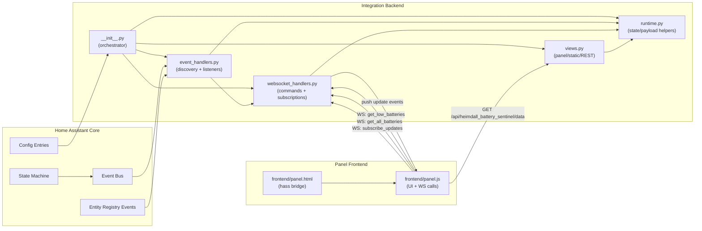

## Heimdall Architecture

This integration is structured into isolated modules with a thin orchestrator:

- `__init__.py`: lifecycle orchestration (`async_setup_entry`, unload, options update)
- `runtime.py`: shared in-memory state and payload helpers
- `event_handlers.py`: discovery + state/event listeners + battery tracking updates
- `websocket_handlers.py`: websocket command registration and push subscriptions
- `views.py`: panel static views and REST data endpoint
- `frontend/panel.js`: LitElement panel UI
- `frontend/panel.html`: iframe bootstrap and Home Assistant websocket bridge

### Runtime Data Model

Per config entry (`hass.data[DOMAIN][entry_id]`):

- `all_batteries`: tracked battery entities keyed by `entity_id`
- `low_batteries`: subset of low batteries keyed by `entity_id`
- `unsub`: listener cleanup callbacks
- `ws_subscribers`: active websocket subscribers for push updates

## Module Interaction Diagram

## Request/Update Flows

### Initial panel load

1. `panel.js` requests low batteries via websocket command `heimdall_battery_sentinel/get_low_batteries`.
2. Backend reads payload from `runtime.py` helpers and returns `low_batteries + threshold`.
3. "All Tracked Battery Entities" remains collapsed until user clicks **Show Table**.

### On-demand full table load

1. User clicks **Show Table**.
2. `panel.js` requests `heimdall_battery_sentinel/get_all_batteries`.
3. Backend returns `all_batteries + threshold`.

### Live updates

1. `event_handlers.py` listens to `state_changed` and `entity_registry_updated`.
2. On add/remove/update of battery entities, runtime structures are updated.
3. `websocket_handlers.py` broadcasts update payloads to subscribers.
4. Frontend updates low-battery table immediately; full table updates live when visible.
